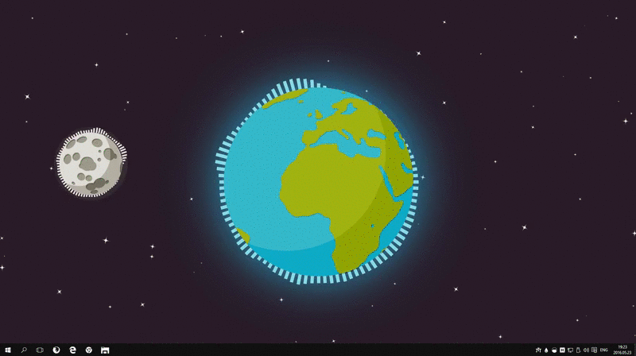
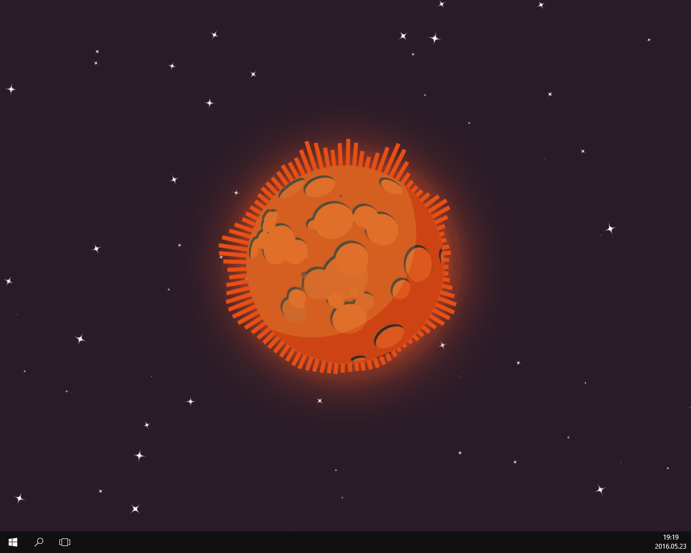
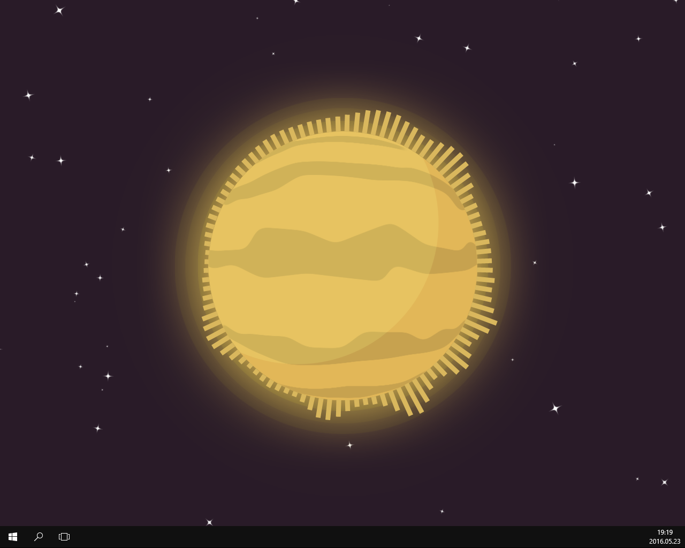
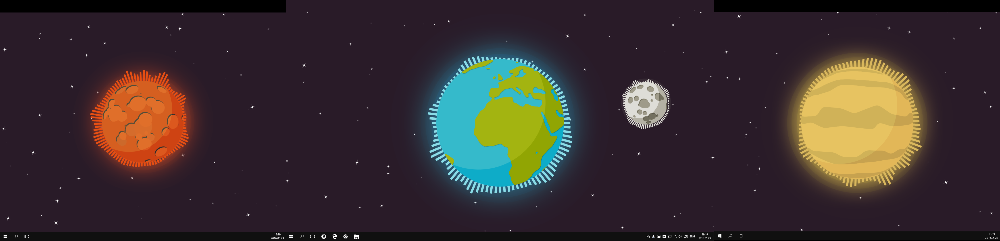

# Planet Themed Desktop with Orbiting Moon and Visualizers Using Rainmeter

This is a Rainmeter skin, so it unfortunately only works for Windows.

## Showcase

The Moon orbits around the Earth, while music visualizers visualize the music being played.

See [here](https://drive.google.com/file/d/0B0tvmozQGIEdZzVWeUdxZWpOT2s/view) for a longer Video with sound.

## How

Whenever the y coordinate of the moon crosses a certain threshold then the z-value of the earth is refreshed, causing it render above the moon. When it is on the opposite side the moon is refreshed, giving the appearance of an orbiting moon.

## Credits

VisBubble visualizer from [here](https://www.deviantart.com/undefinist/art/VisBubble-Round-Visualizer-for-Rainmeter-488601501).

## Issues

The orbit of the moon is retrograde (i.e. it goes the wrong way). 
